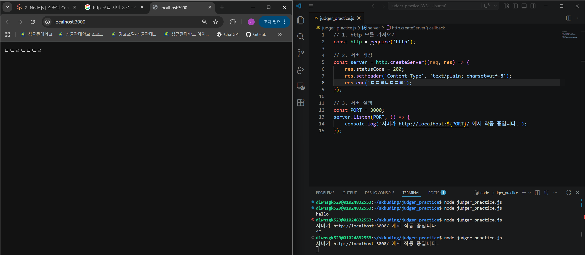
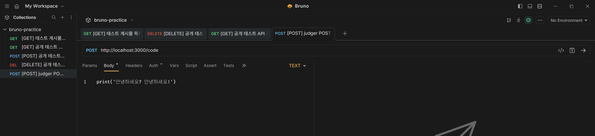
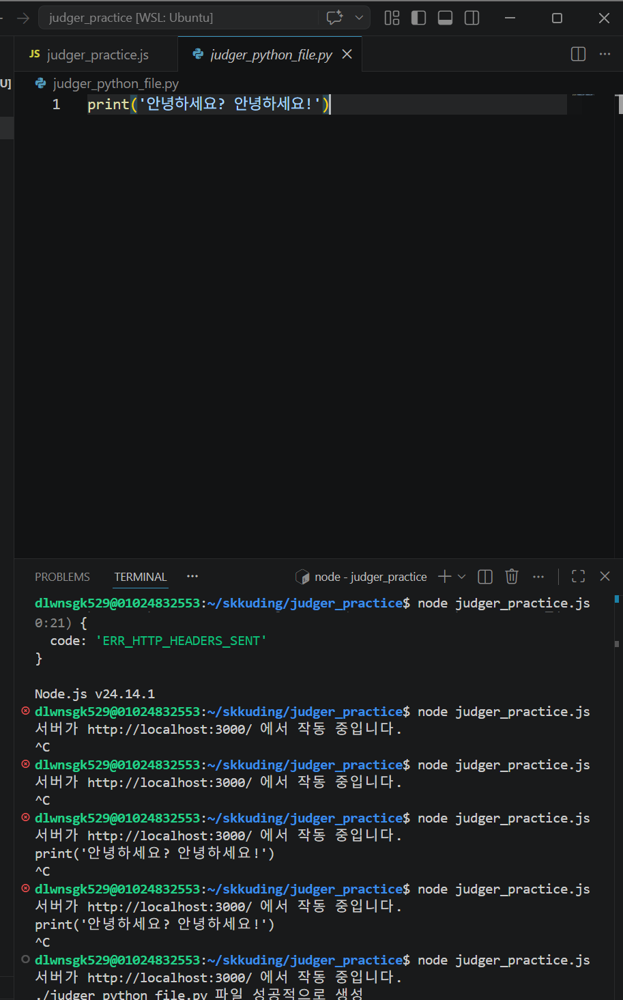
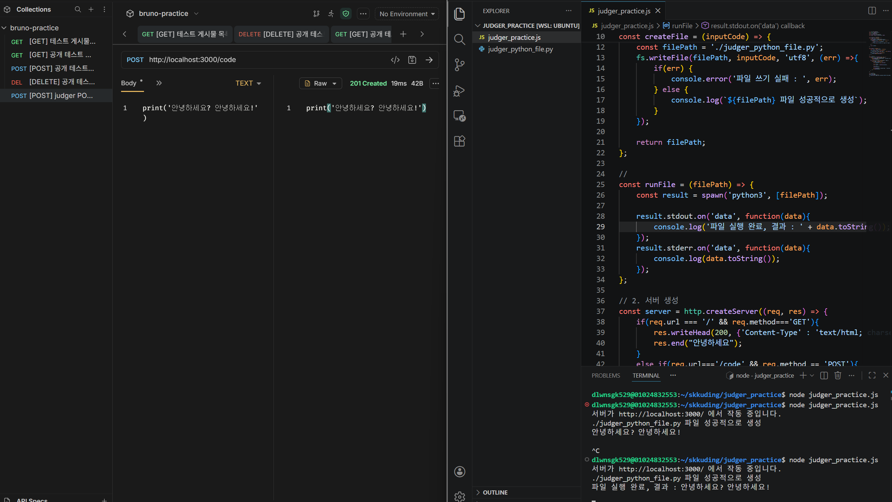
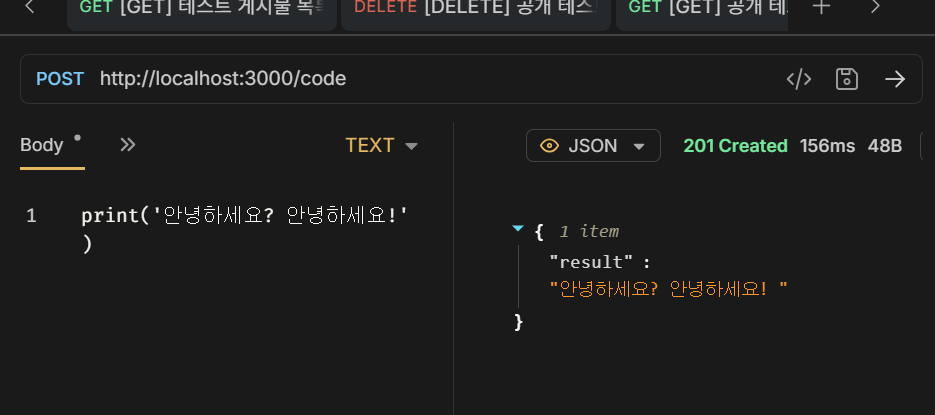

# SKKUDING_Node.js_practice_Week5

## 스꾸딩 5주차 (Node.js) 스터디 프로젝트 실습

### 과제 내용
- http 모듈로 서버를 만들어보세요. 포트 번호는 3000번으로 지정해주세요.
- 요청 메서드는 POST, 코드 데이터는 body에 담아서, 그리고 URL은 /code로 설정해주세요.
- 요청이 오면, 코드를 읽은 다음 fs 모듈을 사용하여 파이썬 파일을 생성해주세요. 그 다음, node.js에 있는 child_process 모듈을 이용하여 command(ex.python3 <filename>)를 실행시킨뒤, 출력을 응답에 담아 보낼 수 있도록 해주세요. (양식은 자유입니다.)
- 에러핸들링은 자유입니다.

### 진행 과정
- 참고
  - Visual Studio Code에서 작성 및 node.js 런타임으로 프로그램 실행.
  - API Testing Tool로 Bruno 사용.
1. http 모듈로 서버 만들기, 포트번호는 3000  
   

    
  

2. POST, 코드 데이터는 body에 담고 url /code로 설정   
   

    
  

3. 요청이 오면 코드를 읽은 다음 fs 모듈로 파이썬 파일 생성   
   

    
  

4. node.js의 child_process 모듈 이용해서 command 실행 시키고   
   

    
  

5. 결과 응답에 담아 보내기   
   

    
  

### 후기
- 기능 구현은 구글링으로 생각보다 쉽게 할 수 있었는데 생각 없이 하다 보니 비동기로 처리되는 작업들이 끝나기도 전에 결과들이 return 돼서 undefined 값으로 프로그램이 실행됐다.
- 그래서 콜백으로 함수들을 구현했더니 이번엔 콜백 지옥(두 개 밖에 없지만)이 생겨 가독성이 매우 떨어졌다.
- 결국 기능 함수들이 Promise 객체를 반환하도록 하고 서버에서는 async/await으로 결과 받도록 수정하였다.
- 에러 핸들링은 따로 하지 않았다.
- 배운 점 : node.js 덕에 javascript로 쉽게 서버 만들고 요청과 응답처리 할 수 있어서 신기했다. + 비동기 작업들 신경쓰자
